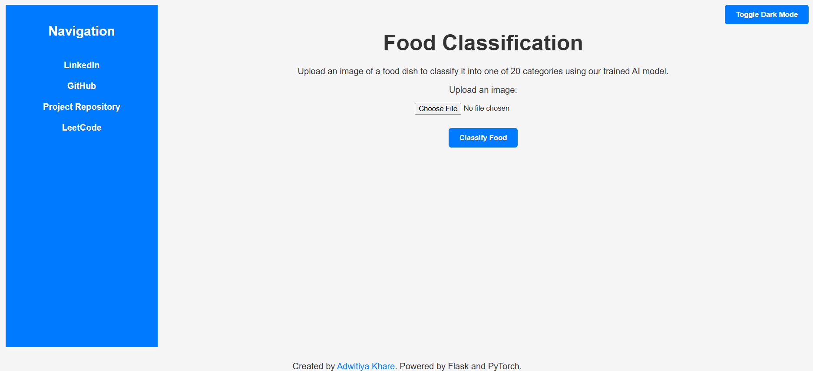
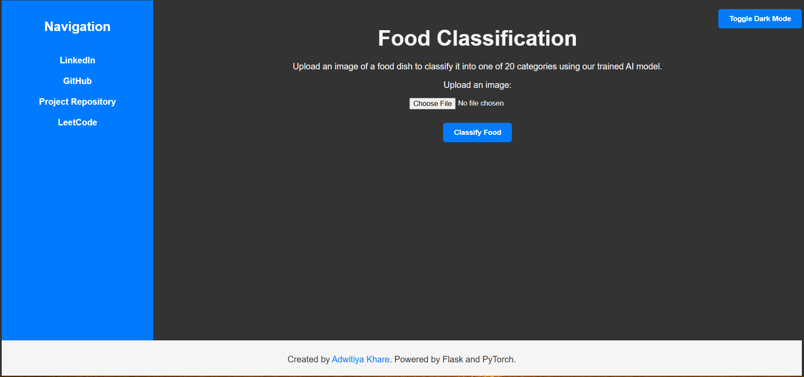
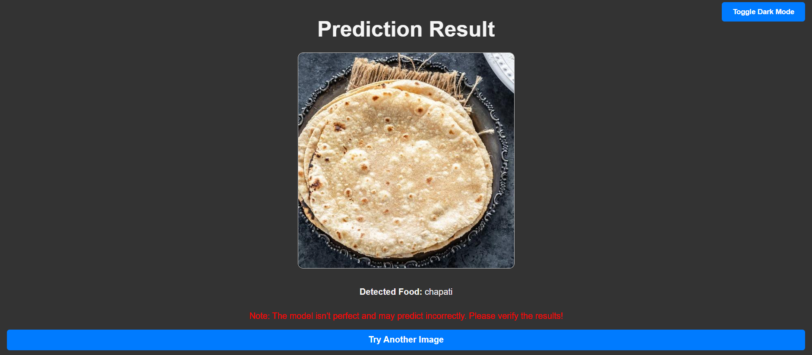

# Food Classifier Web App 🍴

## Overview

*Screenshot of the homepage, showcasing the food image upload interface.*

The **Food Classifier Web App** is a Flask-based web application that uses a Convolutional Neural Network (CNN) model to classify images of food into one of 20 predefined categories. This project demonstrates the integration of AI/ML models with a web interface, making it easy to interact with the model and visualize results.

## Features

- Upload an image of a food dish.
- Crop the image before submitting (using Cropper.js).
- Classify the dish into one of 20 categories using a pretrained PyTorch model.
- Toggle between light and dark modes for better user experience.
- Fully responsive UI with navigation links to personal profiles (GitHub, LinkedIn, etc.).

## Food Categories
The model can classify food into the following categories:
- Burger
- Butter Naan
- Chai
- Chapati
- Chole Bhature
- Dal Makhani
- Dhokla
- Fried Rice
- Idli
- Jalebi
- Kaathi Rolls
- Kadai Paneer
- Kulfi
- Masala Dosa
- Momos
- Paani Puri
- Pakode
- Pav Bhaji
- Pizza
- Samosa

## How It Works

*Result page showing the uploaded image and the predicted food category.*

1. Upload an image from your device.
2. Optionally crop the image using the built-in Cropper.js functionality.
3. Submit the cropped image to the server.
4. The server preprocesses the image and uses the pretrained CNN model to classify it.
5. The result is displayed on a separate page, along with the uploaded image.

## Installation

### Prerequisites
- Python 3.7 or later
- Pip and Virtual Environment

### Model Training
The model used for this project was trained using a [Google Colab notebook](notebooks/model_training.ipynb). 

### Steps
1. Clone this repository:
   ```bash
   git clone https://github.com/AdwitiyaKhare/food-classifier.git
   cd food-classifier
   ```

2. Create and activate a virtual environment:
   ```bash
   python -m venv env
   source env/bin/activate  # On Windows: env\Scripts\activate
   ```

3. Install dependencies:
   ```bash
   pip install -r requirements.txt
   ```

4. Place the pretrained model file (`food_cnn_model_0.00005_29_epochs.pth`) in the root directory of the project.

5. Run the application:
   ```bash
   python app.py
   ```

6. Open your browser and go to `http://127.0.0.1:5000`.

## File Structure
```
food-classifier/
├── app.py                # Flask application script
├── requirements.txt
├── notebooks/
│   ├── model_training.ipynb
├── screenshots/          # Screenshots
│   ├── homepage.png
│   ├── result-page.png
│   ├── dark-mode.png
├── templates/            # HTML templates
│   ├── index.html
│   ├── result.html
├── static/               # Static files
│   ├── css/
│   │   ├── style.css     # Styling for the app
│   ├── js/
│   │   ├── script.js     # JS for homepage
│   │   ├── result.js     # JS for result page
│   ├── uploads/          # Directory for user-uploaded images
├── food_cnn_model_0.00005_29_epochs.pth  # Trained model file
├── README.md             # Project description
└── .gitignore            # Files to exclude from the repository
```

## Technologies Used
- **Frontend**: HTML, CSS, JavaScript (with Cropper.js)
- **Backend**: Flask
- **Machine Learning**: PyTorch
- **Model Architecture**: Convolutional Neural Networks (CNN)

## Acknowledgments
- Dataset: [Kaggle Indian Food Dataset](link-to-dataset)
- Libraries: PyTorch, Torchvision, Flask, Cropper.js
